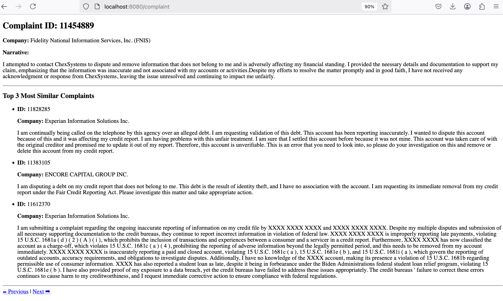

# 🗂️ Complaint Explorer: A Data-Driven Web Application

## 🔍 Project Overview

In this project, you’ll build a simple but powerful Spring Boot web application that helps users explore real-world consumer complaints. These complaints come from a public dataset made available by the **Consumer Financial Protection Bureau (CFPB)** — an independent U.S. government agency that collects reports submitted by consumers about issues they've had with financial products and services.

Your job is to take a **fully functional version of the application**, study its behavior, and then implement key parts of it yourself — including data loading, similarity scoring, and a web interface.

---

## 🧾 What Is a Consumer Complaint?

When individuals in the U.S. have problems with a company (such as incorrect credit reports, loan servicing issues, etc.), they can file a complaint with the CFPB. These complaints are made public after being reviewed and scrubbed of personal info.

Each complaint includes details like:

- The **date** it was received
- The **product** and **sub-product** involved (e.g., "Credit reporting")
- The **issue** and **sub-issue** (e.g., "Incorrect information on your report")
- The **company** involved
- The **consumer narrative** (if the person chose to share it)
- State, ZIP code, how the complaint was submitted, and how the company responded

---

## 🧪 Example Complaint Record

Here’s an example of a single complaint entry in the dataset.  You will find more examples in the ```src/main/resources``` directory:

```
2025-01-09,
Credit reporting or other personal consumer reports,
Credit reporting,
Incorrect information on your report,
Information belongs to someone else,
"I attempted to contact ChexSystems to dispute and remove information that does not belong to me and is adversely affecting my financial standing. I provided the necessary details and documentation to support my claim, emphasizing that the information was inaccurate and not associated with my accounts or activities. Despite my efforts to resolve the matter promptly and in good faith, I have not received any acknowledgment or response from ChexSystems, leaving the issue unresolved and continuing to impact me unfairly.",
Company has responded to the consumer and the CFPB and chooses not to provide a public response,
Fidelity National Information Services, Inc. (FNIS),
IN,
46074,
,
Consent provided,
Web,
2025-01-09,
Closed with explanation,
Yes,
N/A,
11454889
```

Let’s break it down:

- **Date received**: `2025-01-09`
- **Product**: `Credit reporting or other personal consumer reports`
- **Sub-product**: `Credit reporting`
- **Issue**: `Incorrect information on your report`
- **Sub-issue**: `Information belongs to someone else`
- **Narrative**: The consumer’s description of the problem
- **Company**: `Fidelity National Information Services, Inc. (FNIS)`
- **State / ZIP**: `IN / 46074`
- **Submission method**: `Web`
- **Company response**: `Closed with explanation`
- **Complaint ID**: `11454889`

---

## 🧠 Important Notes

- You **do not need to download any data** from the CFPB website — all the data you need will be provided to you directly.
- The dataset has been pre-processed to include:
  - A sample of 30 complaint records to test on
  - A sample of 2,500 complaint records to run the live application
  - A version with **sentence embeddings** generated using a machine learning model (this will be used for comparing similar complaints).  More to come on that next!

---

## 🚧 What You’ll Be Building

In this project, you’re not starting from scratch — you’re starting from a **partially completed application** that includes:

### ✅ What’s Provided:
1. **Starter Code** — A fully structured Java project with classes, data models, and utility functions.
2. **Unit Tests (That Fail)** — We've included a suite of unit tests that currently fail. Your job? **Make them pass.** These tests are designed to help you validate your code as you go — no guessing!
3. **Command-Line Interface (CLI) App** — A simple app you can run from the terminal to test your logic without touching the web.
4. **Spring Boot Web App** — A web interface that lets you view complaints one at a time. It also shows the top 3 most similar complaints based on their content.

---

## 🧠 What You’ll Need to Do

Your goal is to **complete the backend logic and hook it into the web app**. Specifically, you’ll:

- Parse and load complaint data (from CSV and JSONL files).
- Generate sentence **embeddings** (already done for you using a pre-trained model).
- Implement logic to compare complaints using **cosine similarity**.
- Build a user-friendly web interface to browse and explore these complaint records.

---

## 📚 How Similarity Works: Embeddings + Cosine Distance

### ✨ What Are Embeddings?

An **embedding** is a way to turn a piece of text (like a complaint) into a list of numbers — kind of like a "fingerprint" of the meaning behind the sentence. These numbers come from a pre-trained machine learning model (like a neural network) that has been trained to understand human language.

Think of it like this:
> Two sentences that mean similar things will have **similar embeddings**, even if they use different words.

For example:
- "I was charged twice for the same item."
- "The company billed me two times for a single purchase."

Those might look different to you, but to an embedding model, they're **very close** in meaning.

---

### 🧮 What Is Cosine Similarity?

Once you have embeddings (vectors of numbers), you need a way to **compare** them.

That’s where **cosine similarity** comes in. It’s a mathematical way to measure how similar two vectors are by calculating the **angle** between them — not the distance.

- A cosine similarity of `1` means the vectors point in exactly the same direction (very similar).
- A value close to `0` means they’re unrelated.
- A value of `-1` means they point in opposite directions (very different).

In our project, you’ll use cosine similarity to figure out:
> “Which other complaints are most similar to this one, based on what was written?”

---

## 💡 Why Is This Useful?

This kind of similarity detection is super useful in:
- **Customer support** → Automatically suggesting responses based on similar past issues.
- **Search engines** → Ranking results based on relevance.
- **Recommender systems** → “You might also like…” suggestions.
- **Legal/financial tech** → Grouping or deduplicating similar complaints.

By implementing this logic yourself, you’ll gain hands-on experience with **core concepts in machine learning**, **data processing**, and **web development** — all in one project.

---

## 🖥️ Command-Line Explorer: Testing Your Progress

### 🚀 `ComplaintCommandLineExplorer.java`

This class is a **diagnostic command-line tool** designed to help you test your progress as you implement the core functionality of the application.

When everything is wired up correctly, running this class will:

- Load complaint data from a CSV file
- Load sentence embeddings from a JSONL file
- Compute the **top 3 most similar complaints** for each entry
- Print all of this information in a clean, readable format in your terminal

This is one of the **easiest ways to verify** that your code is working before jumping into the web app.

---

### ⚙️ Configuration-Driven

This class uses a file called `config.properties` to find the data files it needs:

```properties
# config.properties (in src/main/resources)
complaints.csv=/complaints_sample_1_30.csv
embeddings.jsonl=/embeddings_mistral_1_30.jsonl
```

You don’t need to modify this unless you want to point to a different dataset.

The config file is loaded using Java's built-in `Properties` class:

```java
Properties config = new Properties();
try (InputStream in = ComplaintCommandLineExplorer.class.getResourceAsStream("/config.properties")) {
    config.load(in);
}
```

This means the program automatically uses the correct files as long as the paths in `config.properties` are valid and the files are in `src/main/resources`.

---

### 🔬 How It Works

Once the complaints and embeddings are loaded, the class does the following:

1. Iterates through all complaints
2. For each complaint:
   - Prints its ID, company, and narrative
   - Uses **cosine similarity** to find the top 3 most similar complaints
   - Prints the results in a readable format

This makes it really easy to visually verify that your similarity logic is working.

---

### ✅ What Needs to Be Working First?

This class depends on **your implementation** of several core components. To get it working, you’ll need to:

- ✔️ **Load complaints from a CSV** → Implement `ComplaintLoader`
- ✔️ **Load embeddings from a JSONL file** → Implement `EmbeddingLoader`
- ✔️ **Match embeddings to complaints** → Implement `ComplaintMerger`
- ✔️ **Compute similarity scores** → Implement `ComplaintSimilarityService`

There are **unit tests provided** that test each of these components in isolation. When you make all of them pass, you should be able to run this class and see a successful output.

---

## 🧩 What’s Broken (On Purpose)

To help you learn by doing, we’ve **intentionally removed key pieces of code** from several classes in this project. Your job is to read the structure, understand the goals, and fill in the missing logic.

Where code has been removed, you’ll find **`TODO` comments** that clearly indicate where you need to work. Some of these are simple method stubs — others will require you to think through the logic and use the tools provided elsewhere in the project.

---

### 🛠️ The Following Components Are Incomplete:

- `EmbeddingLoader.java`  
- `ComplaintMerger.java`  
- `ComplaintLoader.java`  
- `ComplaintSimilarityService.java`

Each of these plays a critical role in making the application work. You’ll need to complete **each one** in order to:

- Pass the provided unit tests
- Get the command-line tool working
- Enable the Spring Boot web app to function properly

---

### 📦 Dependency Cleanup

Some libraries and dependencies have been removed from the `pom.xml` and you will need to fix those as well! All remaining tools are fully supported and ready to use.

---

### 🧠 Your Mission

Your task is to:
- Read the code carefully
- Understand how the pieces fit together
- Fill in the blanks — one method at a time

There are no shortcuts here: the application **will not run correctly until you’ve implemented all the necessary logic.** But once you do, you’ll be able to see your work in action via both the command-line app and the web interface.  And do not forget, you need to add the dependencies!

---
## 🌐 Running the Web App

Once you’ve implemented the core functionality of the project (loading complaints, calculating similarity, etc.), you can view your work through a fully functional **Spring Boot web application**.

---

### 🚀 How to Run the Web App (from the Command Line)

Make sure you're in the root directory of the project (where `pom.xml` lives), and then run:

```bash
mvn spring-boot:run
```

This will:

- Compile your code
- Launch the embedded web server (Tomcat, built into Spring Boot)
- Host your app locally at:  
  👉 `http://localhost:8080/complaint`

Once the server is running, open your browser and go to the link above.

---

### 🧭 What the Web App Does

The web app allows you to:

- View one complaint at a time
- See all its associated fields (product, issue, narrative, etc.)
- Navigate through complaints using **Previous / Next** buttons
- View the **3 most similar complaints**, based on the content of the complaint narrative

If any core logic is missing or broken, the web app may fail to start or show incomplete results — that's your cue to go back and finish implementing the `TODO`s in the backend!

---

### 🛠️ What Is Spring Boot?

Spring Boot is a powerful framework for building Java-based web applications. It does a lot of the heavy lifting for you, including:

- Starting a built-in web server (no setup needed)
- Handling routing (e.g. mapping `/complaint` to a method in a controller)
- Automatically loading resources and configuration files
- Managing dependencies and object creation via dependency injection

You’ll see Spring Boot in action in classes like:

- `ComplaintWebApp.java` – The main entry point for the app
- `ComplaintController.java` – Handles web requests and prepares data for the HTML view

You don’t need to be a Spring expert to complete this project — we’ve set it up so that once your data loading and similarity code works, the web interface will work too.

---

### ✅ When Everything Works...

If you’ve completed your logic correctly and your code compiles, the web app will become your **main visual tool** for exploring and verifying complaints. You’ll be able to:

- Read real consumer narratives
- See which complaints are most alike
- Quickly test your understanding of how the system works

Here is what it looks like:



---

Of course! Here's a clean, direct, and student-friendly section you can drop into your Markdown file. It explains the **required Web UI tasks**, emphasizes **error handling**, and reminds them about the **data size limit**.

---

## 🎨 Your Web UI Tasks

Once you’ve got the backend working, you’ll enhance the web interface to show more information and add interactive features. The HTML file you’ll modify is:

📄 `src/main/resources/templates/complaint.html`

---

### ✅ Task 1: Display More Complaint Details

Currently, the web page shows a minimal amount of information for each complaint. You must **expand the UI** to include the following fields:

- Date received  
- Product  
- Sub-product  
- Issue  
- Sub-issue  
- Narrative (already shown — keep it)  
- Company public response  
- Company  
- State  
- ZIP code  

Each of these fields exists in the `Complaint` object and can be accessed using Thymeleaf syntax like this:

```html
<span th:text="${complaint.product}"></span>
```

Use HTML elements (like `<p>`, `<div>`, or `<span>`) to organize and label the data cleanly for the user.

---

### ✅ Task 2: Implement a “Jump To” Box

You must add a form that allows the user to **enter a complaint number** and jump directly to that entry.

Requirements:

- Use a text box + submit button
- When submitted, the page should load the complaint at the specified index (0 to 2499)
- The form should submit to the same `/complaint` endpoint using a GET request with a query parameter named `index`

Example:

```html
<form method="get" action="/complaint">
  <label for="indexInput">Jump to complaint #:</label>
  <input type="text" name="index" id="indexInput" />
  <button type="submit">Go</button>
</form>
```

---

### ❗ Task 3: Defend Against Invalid Input

Your controller already includes some logic to validate the input index. You must make sure that:

- If the user enters a value **less than 0**, **greater than 2499**, or a **non-number**, an error message is shown on the page.
- You must **display this error message in the HTML** if it’s present.

Here’s how you can show the error in your template:

```html
<p th:if="${error != null}" th:text="${error}" style="color: red;"></p>
```

This will let the user know when something has gone wrong — and help prevent crashes or confusing behavior.

---

### 📌 Reminder: Maximum Number of Complaints

The dataset you are working with contains **2,500 complaints**, and they are indexed from `0` to `2499`.

If a user tries to jump to `2500` or higher, your app should:
- Catch the invalid input
- Show a helpful message
- Return the user to a valid complaint (e.g., index 0)

---

Let’s wrap this up in style! 🎉 Here's your final section — clear, professional, and encourages good version control hygiene. It emphasizes the importance of using Git and GitHub as part of the learning experience.

---
## 🗂️ Final Deliverable: A Clean GitHub Repository

Your last task is to prepare a clean, organized, and professional-looking GitHub repository containing your completed project.

This is part of your grade — and more importantly, it's a great habit that mirrors how real-world development is done.

---

### ✅ What Your GitHub Repo Should Include

- All of your **Java source code** (`src/main/java`)
- Your **test files** (`src/test/java`)
- Your updated **HTML template** (`complaint.html`)
- The provided **config file** (`config.properties`)
- Your **`pom.xml`** file
- Any data files used (`.csv` or `.jsonl`) — if under 100MB

---

### 🚫 What to Exclude

Make sure your repo **does not include**:

- The `target/` folder (generated by Maven)
- `.class` files or other build artifacts
- IDE-specific files like `.idea/` (from IntelliJ) or `.DS_Store` (Mac)
- Any large files you weren’t instructed to include

Use a `.gitignore` file to keep things clean! Here’s a basic one you can use:

```bash
# .gitignore
target/
.idea/
*.class
*.log
*.iml
.DS_Store
```

---

### ✅ Submit Your Link

When you're done, submit your **GitHub repo URL** to the D2L dropbox.

## 🧮 Project Scoring Rubric

| Category | Description | Points |
|----------|-------------|--------|
| **1. Data Loading Logic** | Correctly loads complaints from CSV and embeddings from JSONL using `ComplaintLoader`, `EmbeddingLoader`, and `ComplaintMerger`. | **15** |
| **2. Similarity Service** | `ComplaintSimilarityService` correctly computes cosine similarity and returns the top 3 most similar complaints (unit test passes). | **15** |
| **3. Unit Tests** | All provided unit tests are passing. Partial credit may be awarded if most but not all are working. | **10** |
| **4. Command-Line Explorer** | CLI app (`ComplaintCommandLineExplorer`) runs without crashing and displays complaint data and similarity matches as expected. | **10** |
| **5. Web App Functionality** | Spring Boot app starts up, loads complaint data, and displays it correctly at `http://localhost:8080/complaint`. | **10** |
| **6. Web UI Enhancements** | All required fields are added to the `complaint.html` page: product, issue, company, etc. (as listed in instructions). | **10** |
| **7. “Jump-To” Functionality** | A form allows jumping to a specific complaint by index. Handles invalid input gracefully and displays errors on the page. | **10** |
| **8. Code Quality** | Code is clean, readable, and follows consistent formatting. Meaningful variable names, no commented-out solution code left in. | **5** |
| **9. GitHub Repository** | Repo is organized, with a clear commit history, a working `.gitignore`, and only necessary files checked in. | **10** |
| **10. Overall Completeness & Professionalism** | App functions end-to-end and shows thoughtful effort and attention to detail. | **5** |

**💯 Total Points: 100**

